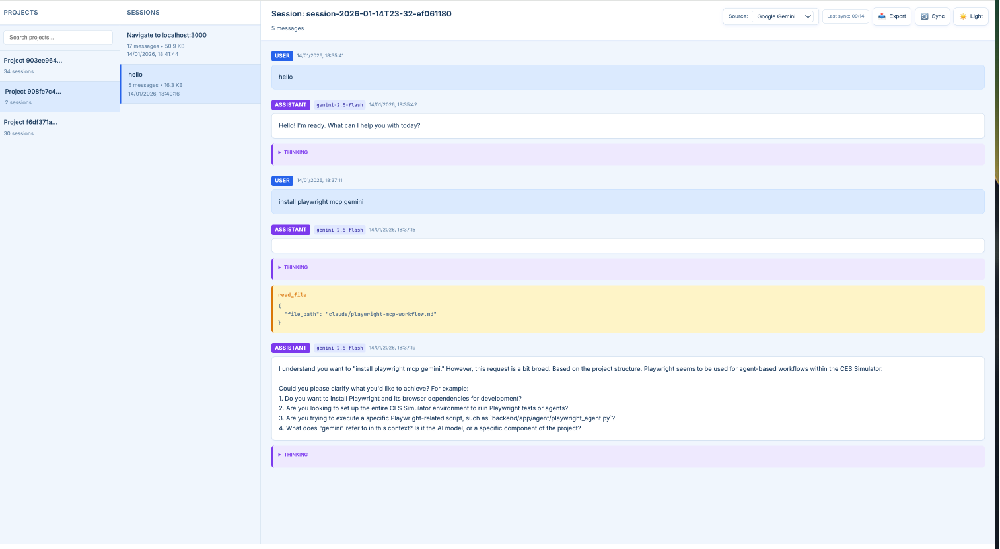
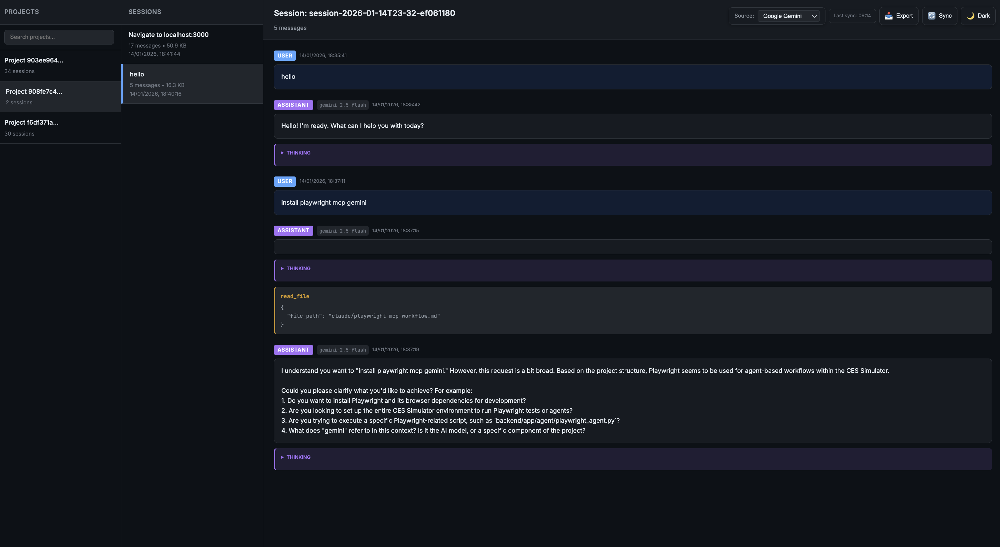

<div align="center">
<h1>AI History Viewer</h1>
<p>A lightweight web app to browse and view your Claude Code, OpenAI Codex, and Google Gemini conversation history</p>

<p>
  <a href="#features">Features</a> •
  <a href="#supported-tools">Supported Tools</a> •
  <a href="#installation">Installation</a> •
  <a href="#usage">Usage</a> •
  <a href="#screenshots">Screenshots</a>
</p>

<p>
  
  
  
  <a href="http://makeapullrequest.com">
    
  </a>
</p>
</div>

---

## Features

- **Multi-source support** — View history from Claude Code and OpenAI Codex
- **Three-panel layout** — Projects → Sessions → Conversation
- **Auto-sync** — Backs up data from source directories every hour
- **Export** — Download any conversation as a `.txt` file
- **Theme support** — Light (soft blue) and Dark modes
- **Rich display** — User/Assistant messages, thinking blocks, tool usage, tokens
- **Search** — Find projects and conversations quickly

## Supported Tools

| Tool | Source Directory | Status |
|------|------------------|--------|
| **Claude Code** | `~/.claude/projects/` | ✅ Supported |
| **OpenAI Codex** | `~/.codex/sessions/` | ✅ Supported |
| **Google Gemini** | `~/.gemini/tmp/` | ✅ Supported |

### Claude Code
- Sessions organized by project directory
- Displays summaries, messages, thinking blocks, and tool uses
- Shows model info and token usage

### OpenAI Codex
- Sessions organized by date (`YYYY/MM/DD/`)
- Groups sessions by working directory (cwd) as "projects"
- Displays messages, function calls, and reasoning blocks
- Filters out system prompts for cleaner viewing

### Google Gemini
- Sessions stored as JSON files in `{hash}/chats/session-*.json`
- Groups sessions by project hash
- Displays messages, thoughts (thinking), and tool calls
- Shows model info and token usage (input, output, cached)

## Installation

```bash
git clone https://github.com/YOUR_USERNAME/ai-history-viewer.git
cd ai-history-viewer
```

## Usage

**One command to run:**

```bash
./run.sh
```

Or manually:

```bash
pip install -r requirements.txt
python app.py
```

Open **http://localhost:5050** in your browser.

## How It Works

1. **Startup** — Syncs data from both source directories to local `./data/` folder
2. **Background sync** — Updates every hour automatically
3. **Manual sync** — Click the sync button to refresh current source
4. **Source switching** — Use the dropdown to switch between Claude Code and Codex

### Data Storage

```
data/
├── claude-code/          # Claude Code backup
│   ├── -Users-project1/
│   │   ├── session1.jsonl
│   │   └── session2.jsonl
│   └── -Users-project2/
├── codex/                # OpenAI Codex backup
│   └── 2026/
│       └── 01/
│           ├── 16/
│           │   └── rollout-xxx.jsonl
│           └── 17/
└── gemini/               # Google Gemini backup
    ├── {project-hash-1}/
    │   └── chats/
    │       ├── session-2026-01-17T12-57-xxx.json
    │       └── session-2026-01-17T13-04-xxx.json
    └── {project-hash-2}/
```

## Controls

| Control | Action |
|---------|--------|
| **Source** dropdown | Switch between Claude Code, Codex, and Gemini |
| 📥 Export | Download current conversation as `.txt` |
| 🔄 Sync | Manually refresh data from current source |
| ☀️/🌙 Theme | Toggle light/dark mode |

## Screenshots

| Light Mode | Dark Mode |
|------------|-----------|
|  |  |

## Project Structure

```
ai-history-viewer/
├── app.py              # Flask backend (multi-source support)
├── run.sh              # Run script
├── requirements.txt    # Dependencies
├── data/               # Synced data (auto-created)
│   ├── claude-code/    # Claude Code backup
│   ├── codex/          # OpenAI Codex backup
│   └── gemini/         # Google Gemini backup
└── templates/
    └── index.html      # Frontend
```

## API Endpoints

| Endpoint | Method | Description |
|----------|--------|-------------|
| `/api/sources` | GET | List available sources |
| `/api/sources/<id>` | POST | Set current source |
| `/api/projects?source=` | GET | List projects for source |
| `/api/projects/<id>/sessions?source=` | GET | List sessions in project |
| `/api/projects/<id>/sessions/<id>?source=` | GET | Get conversation |
| `/api/sync?source=` | POST | Trigger manual sync |
| `/api/status?source=` | GET | Get sync status |

## Requirements

- Python 3.7+
- Flask 2.0+
- flask-cors

## Adding New Sources

To add support for another AI coding tool, update `app.py`:

```python
SOURCES = {
    "claude-code": {
        "name": "Claude Code",
        "source_dir": Path.home() / ".claude" / "projects",
        "data_subdir": "claude-code"
    },
    "codex": {
        "name": "OpenAI Codex",
        "source_dir": Path.home() / ".codex" / "sessions",
        "data_subdir": "codex"
    },
    "gemini": {
        "name": "Google Gemini",
        "source_dir": Path.home() / ".gemini" / "tmp",
        "data_subdir": "gemini"
    },
    # Add new source here:
    "new-tool": {
        "name": "New Tool",
        "source_dir": Path.home() / ".newtool" / "history",
        "data_subdir": "new-tool"
    }
}
```

Then implement the parsing functions for the new tool's format.

## License

MIT

---

<div align="center">
<sub>Built for browsing AI coding assistant conversations</sub>
</div>
